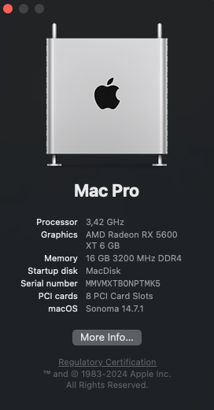

# hackintosh-opencore-config
---
##### computor
[]
- **Motherboard** - B760M Pro RS/D4
    - **Audio**: Realtek ALC897 - AppleALC - ```alcid=98``` (config.plist  NVRAM $\rightarrow$ 7C436110-AB2A-4BBB-A880-FE41995C9F82 $\rightarrow$ boot-args)
    
    - **Network**: Dragon RTL8125BG - needs ```LucyRTL8125Ethernet.kext```
---
- **CPU** -  i7-13700k
- **GPU** - AMD Radeon RX 5600-XT
    - ```agdpmod=pikera``` boot-args needed (config.plist  NVRAM $\rightarrow$ 7C436110-AB2A-4BBB-A880-FE41995C9F82 $\rightarrow$ boot-args) 
- **SMBIOS** - MacPro7,1
---

**Hide EFI boot option**
+ config.plist $\rightarrow$ Misc $\rightarrow$ Security $\rightarrow$ ScanPolicy = 17760515
---
**Skip boot picker**
+ config.plist $\rightarrow$ Misc $\rightarrow$ Boot $\rightarrow$ ShowPicker = False
---

